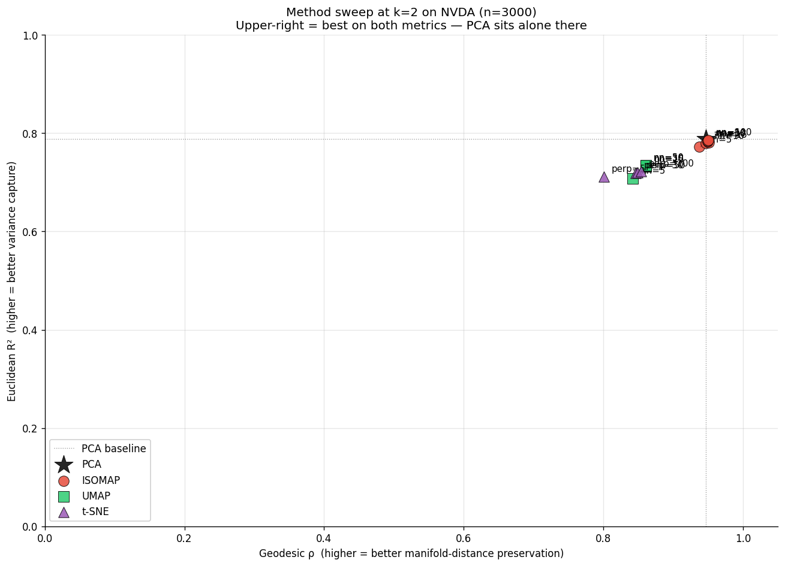

# DS4FE — Weekly Progress Log

Limit Order Book Feature Engineering Series

Start: Feb 25, 2026 | Today: Jun 3, 2026 | Total: **15 weeks**

**Working note.** This is a working progress log, not a final paper. I keep some earlier interpretations in place even when later experiments corrected them, because the goal is to show the research path: what was tried, what failed, and how the conclusion changed over time.

---

## Week 1 (Feb 25 – Mar 3, 2026) — Onboarding + Part 1: Daily Data Tour

- Reviewed LOB microstructure literature (order flow imbalance, depth profiles, Kyle's Lambda); familiarized with Databento mbp-1/mbp-10 schemas; scoped the series structure
- Universe: 50 large-cap US stocks × 5 sectors (Tech, Healthcare, Financials, Consumer, Energy), daily OHLCV Jan 2010 – Dec 2024
- Data files: `ds4fe_panel.parquet`, `ds4fe_market.parquet`, `ds4fe_daily_prices.parquet`
- Macro context: SPY return, VIX, 10Y–2Y yield spread, USD index
- Beta regression of each stock on SPY: R² 0.20–0.80 across sectors — market explains most but not all variance
- Sector heatmaps + rolling correlations to motivate cross-sectional factor framing

**Deliverable:** `DS4FE_Part1_Daily_Data_Tour.ipynb`

---

## Week 2 (Mar 4–10, 2026) — Part 2: Daily Feature Engineering

12 features × 4 families on the full 50-stock panel (~175k aligned obs):

- **Momentum (4):** `mom_1d`, `mom_5d`, `mom_21d`, `mom_63d` — log-return lookbacks
- **Realized vol (2):** `vol_21d`, `vol_63d` — rolling std of daily log returns
- **Volume/liquidity (2):** `volume_ratio` (today's vol / 21d avg), `amihud` (|return| / dollar vol × 10⁶)
- **Macro (4, lagged 1d to avoid look-ahead):** `spy_ret`, `vix_level`, `yield_spread`, `dollar_index`

IC analysis (Spearman ρ + t-stats) against next-day cross-sectional return; quintile sorts with Q5–Q1 cumulative spread. Framing: cross-sectional (rank stocks against each other) vs time-series prediction.

**Deliverable:** `DS4FE_Part2_Daily_Features.ipynb`

---

## Week 3 (Mar 11–17, 2026) — Part 3: Single-Stock Prediction (AAPL)

- Feature set expanded to 15 (added `mom_252d`, `vol_ratio`, `vix_chg`)
- **Look-ahead bias demo:** `.shift(1)` fix, train/test contamination pitfall
- Walk-forward CV: 504-day seed, expanding train, 1-day-ahead, no shuffling
- Models: Ridge, Random Forest, XGBoost — all IC ≈ 0.01–0.02; win rate ~50–52%
- Directional trading simulation with transaction-cost sensitivity
- Cross-frequency comparison: daily R² ≈ ±0.001 vs NVDA intraday LOB XGBoost R² = +0.00029

**Verdict:** Daily-frequency direction prediction is essentially random. Pivot to LOB.

**Deliverable:** `DS4FE_Part3_Single_Stock_Prediction.ipynb`

---

## Week 4 (Mar 18–24, 2026) — Part 5: Multifactor Models

- Cross-sectional factor model combining momentum, vol, volume, and macro features
- Cross-sectional vs time-series momentum framing: ranking stocks against each other vs predicting one stock's direction
- Series-wide cleanup: textbook-style prose rewrite, fixed cross-references, feature counts; added `.gitignore` and `DS4FE_Series_Notes.md`

**Deliverable:** `DS4FE_Part5_Multifactor.ipynb`

---

## Week 5 (Mar 25–31, 2026) — Part 4 (initial): LOB Feature Engineering

- Databento mbp-1 data; OFI construction; calm vs stress comparison; cross-asset SPY signal
- Ridge walk-forward + XGBoost benchmark (with look-ahead audit note); OOS R² by hour
- Restructured with Part I / Part II divider; expanded IC vs OOS R² discussion

**Deliverable:** `DS4FE_Part4_LOB_Features.ipynb` (later split in Weeks 6–7)

---

## Weeks 6–7 (Apr 1–14, 2026) — Part 4 split into 4a–4d (consolidation/refactor)

- **4a:** LOB Data Demo — Databento mbp-1 schema, event types, calm (Oct 2023) vs stress (Aug 5 2024 BOJ shock) comparison
- **4b:** Features & IC — OFI construction, daily IC, t-stats, calm vs stress IC, cross-asset SPY signal
- **4c:** Model Importance — Ridge vs XGBoost, walk-forward CV, hyperparameter grid, OOS R² by hour
- **4d:** Multi-Stock — pooled 5-symbol model (NVDA, AAPL, TSLA, MSFT, SPY), within-symbol rolling z-score, cross-sectional OBI deviation
- API key moved from source to `.env`

**Deliverables:** Parts 4a–4d structured and committed.

---

## Week 8 (Apr 15–21, 2026) — Part 4e: Trade Tape Features

- Downloaded Databento `trades` for 5 symbols × 2 periods (~560 MB, 10 parquet files); added `download_trades.py`
- Educational framing: "The Illusion of the Order Book — Intent vs. Action"
- **SVR** (`signed_volume_ratio`): buyer vs seller aggressor volume in [−1, 1]; IC @ 1s = **−0.065** (strongest single feature)
- **MVB** (`mid_vwap_bias`): rolling 60s VWAP vs mid-price in bps; IC @ 10s = +0.016
- SVR ↔ OBI correlation low → genuinely orthogonal to the order book
- Walk-forward XGBoost: LOB-only R² = −0.00115 → LOB + SVR + MVB = +0.00017
- Executed Part 4d with per-symbol OOS R² bar chart

**Deliverables:** All 4a–4e notebooks clean and pushed to `main`.

---

## Week 9 (Apr 22–28, 2026) — Part 4a polish for presentation

- Deleted superseded monolithic `DS4FE_Part4_LOB_Features.ipynb`
- Fixed uint32 overflow in calm vs stress OBI (bid/ask sizes cast to int64)
- Replaced NVDA with SPY for calm-vs-stress (NVDA's shock was overnight; SPY shows the textbook spread spike)
- Fixed order-book snapshot: row 500 (09:30:02, book not yet built) → 11:30 ET mid-session
- Added calm-vs-stress event-type grouped bar chart, section transitions, summary handoff cell; rewrote em-dash-heavy prose

**Deliverables:** Part 4a fully polished, pushed to `main`.

---

## Week 10 (Apr 29–May 5, 2026) — Initial ISOMAP arc (Parts 4f / 4g / 4h / 4i)

**Built Part 4f (ISOMAP), 4g (multi-symbol DR), 4h (joint ISOMAP), 4i (stress projection). Professor check-in May 1.**

> ⚠️ The headline numbers below are **method-internal** (each method scored on its own loss function). Week 12's cross-over test shows this is apples-to-oranges; full reconciliation in `DS4FE_LOB_ISOMAP_v3.ipynb`.

### Part 4f — Unsupervised LOB Feature Engineering: ISOMAP

- Downloaded full calm-period mbp-10 data for NVDA (Oct 2–31, 22 trading days, ~50M ticks) via Databento
- Built Part 4f notebook end-to-end:
  - Animated order book visualization (9:30–10:30 opening hour, 30-second steps, interactive jshtml player)
  - Constructed 10D OBI feature matrix: OBI at each of 10 depth levels, aggregated to 1-minute bars
  - Rolling L0–L9 correlation chart: banded structure (adjacent levels 0.76–0.86; L0 vs L9 = 0.07) — direct evidence that the book state lives on a low-dimensional manifold
  - ISOMAP fit (n_components=2, n_neighbors=15): reconstruction error = 0.028, **97.2% of geodesic manifold structure preserved in 2D**
  - PCA comparison: 78.6% in 2D — 18.6 pp gap confirms manifold is curved, not flat
  - Scree plot: elbow at 2 components (3rd adds < 1 pp), confirming intrinsic dimensionality ≈ 2
  - Depth profile bar chart: Z₁ peaks at L6 (book-wide consensus), Z₂ has sign-flip at L4–L5 (HFT-vs-institutional contrast axis)
  - Improved 2×5 all-levels scatter grid: shared colorbar, gradient-direction arrows, spine color-coding by dominant axis
  - OOS projection via Nyström extension: Oct 10–31 states land cleanly inside training manifold region
  - XGBoost IC comparison: Raw 10D OBI IC ≈ 0; ISOMAP 2D IC = +0.048 (t=1.66, marginal); ISOMAP distills correlated inputs into a more useful representation

**Key finding:** The 10-level OBI vector has intrinsic dimensionality ≈ 2. ISOMAP recovers this structure with 97.2% fidelity. Two axes emerge: Z₁ (book-wide consensus, peaks at L5–L6) and Z₂ (HFT-vs-institutional contrast, sign-flip at L4–L5).

### Part 4g — Multi-Symbol DR Comparison (NVDA, AAPL, MSFT)

- Downloaded full Oct 2023 mbp-10 data for AAPL and MSFT (split requests to avoid timeout)
- Ran identical pipeline per symbol (PCA, ISOMAP, t-SNE, UMAP, K-Means, OOS IC)
- Cross-symbol comparison table:

  | Metric | NVDA | AAPL | MSFT |
  |--------|------|------|------|
  | ISOMAP 2D preserved | 97.2% | 96.7% | 96.7% |
  | PCA 2D variance | 78.6% | 82.2% | 87.0% |
  | ISOMAP gap over PCA | +18.6 pp | +14.5 pp | +9.7 pp |
  | Z₁ peak level | L6 | L7 | L4 |
  | Z₂ sign-flip (crossover) | ~L4–L5 | ~L5–L6 | ~L4 |
  | Best K (clusters) | 2 | 2 | 2 |
  | OOS IC (ISOMAP 2D) | +0.004 | +0.011 | +0.020 |

**Key finding:** Z₁/Z₂ structure is consistent across all three large-cap Nasdaq names. K=2 (open/close vs mid-day) is universal. ISOMAP consistently outperforms PCA by 10–19 pp.

### Part 4h — Joint ISOMAP: Unified LOB Manifold

- Pooled all three symbols' 1-min OBI bars (no scaler — OBI already in [−1, 1]) into one ~19,300-bar training set
- Fit ONE Isomap (n_components=2, n_neighbors=30) on the pooled data
- Joint reconstruction error = 0.027 → **97.3% preserved** — matches per-symbol quality
- Symbols **overlap** on the shared manifold — no clean stock-identity separation; regimes are market-wide
- Z₁/Z₂ interpretation **survives** joint training: Z₁=consensus (peaks L5), Z₂=contrast (sign-flip L4–L5)
- Joint UMAP: K=2 optimal (silhouette = 0.538, highest of all models); cluster membership is mixed-symbol
- OOS IC near zero in pooled cross-symbol prediction — per-symbol calibration needed for predictive use

**Key finding:** The LOB manifold is approximately universal across large-cap Nasdaq names in the same market window. Stock identity is a second-order effect; intraday time-of-day regimes dominate.

### Part 4i — Stress Period Projection: BOJ Shock Week on the Calm Manifold

- Downloaded NVDA mbp-10 data for Aug 5–9, 2024 (BOJ shock week, 31.6M rows)
- Built `run_4i_stress_projection.py` comparing two feature representations:
  - **Model A (10 features — OBI means only):** stress bars land inside calm cloud; only 3.6% outside calm 95th percentile
  - **Model B (20 features — OBI means + within-minute OBI std):** 16.8% outside 95th; stress mean distance = 2× calm mean
- Key insight: 1-minute mean OBI washes out directional crashes (every update within the minute points the same way → mean is moderate). The within-minute standard deviation is the stress signal — lower during a directional move, not higher.
- Additional findings: book depth 11× higher during stress (includes 10:1 June 2024 split); manifold path length 0.1–1.4 SD shorter than calm (book locked into fewer states despite larger price moves)
- Built `DS4FE_Part4i_Stress_Projection.ipynb` with 6 figures including Aug 5 minute-by-minute trajectory and manifold distance through the week

**Key finding:** Mean OBI alone is insufficient to detect regime stress. Adding the second moment (within-minute OBI std) makes the structural abnormality detectable — 4× more stress bars flagged — without labels, price data, or model retraining.

**Deliverables:** Parts 4f, 4g, 4h, 4i notebooks and all scripts committed; figures in `figures/`.

---

## Week 11 (May 5–11, 2026) — Demo notebook polish (`DS4FE_ISOMAP_Demo.ipynb` rebuild)

Received a cell-by-cell critique and implemented all corrections.

**Structural changes (56 → 42 cells, 8 sections):**

- Rebuilt from scratch via `build_demo_notebook.py` for reproducibility
- Replaced mislabeled `4f_isomap_vs_pca.png` (showed OBI₀ coloring, not a PCA comparison) with `4g_NVDA_scree.png`
- Trimmed per-symbol deep dive (15 figures) to summary table + joint embedding + joint depth profile
- Added Part 4i stress projection as Section 8 (3 figures: model comparison, Aug 5 path, manifold distance)

**12 factual/framing fixes:**

| Fix | Detail |
|-----|--------|
| Raw data scale | Removed "50M ticks/day" headline; states "8,580 bars after aggregation" |
| Snapshot description | "Noisy and uneven — that's why we aggregate" instead of "balanced" |
| k inconsistency | Explicitly states k=15 per-symbol, k=30 for joint/stress; resolves figure label mismatch |
| "97% fidelity" language | Reframed as geometry-fidelity measure; note it is not directly comparable to PCA explained variance |
| Z₂ sign | Fixed to match depth-profile figure: negative near top-of-book, positive deeper; sign arbitrariness noted |
| Time-of-day regime claim | "Shared book-state space" rather than "time of day is stronger than stock identity" |
| OOS IC overclaim | p≈0.20; "main contribution is state representation, not standalone prediction" |
| Joint embedding | Weakened unsupported "stronger organizing dimension" claim |
| BOJ chronology | Rate hike July 31 (effective Aug 1); selloff Aug 5 — not conflated |
| Stress-distance contradiction | "Shifts upward, more extreme tail" — not "persistently above 95th" (only 16.8% exceed it) |
| Conclusion | Rewritten around state representation + regime detection; no return-prediction overclaim |
| Narrative order | Section 2 reordered: snapshot → heatmap → correlation → ISOMAP motivation |

### New figure: neighbor sensitivity

- Generated `4g_NVDA_neighbor_sensitivity.png`: ISOMAP 2D fidelity for k = 5, 10, 15, 20, 30, 50
- Result: (1 − residual) stays 0.951–0.980 across the full range — the 2D structure is stable and not sensitive to the choice of k
- Directly answers the expected question: "How sensitive is this to n_neighbors?"

**Deliverables:** `DS4FE_ISOMAP_Demo.ipynb` (42 cells, 18 embedded figures), `build_demo_notebook.py`, `gen_neighbor_sensitivity.py` — all committed and pushed.

---

## Week 12 (May 11–12, 2026) — Cross-over → v3 honest rebuild → robustness sweep

The Week 10 "ISOMAP wins" headline was tested rigorously and **rejected**. Final canonical notebook is `DS4FE_LOB_ISOMAP_v3.ipynb`.

### 12.1 — Why the original "ISOMAP wins" was misleading

The original scree comparison ("ISOMAP needs 2D, PCA needs 7D") used **different** loss functions for the two methods. Correct comparison: both methods scored on **both** Spearman ρ (geodesic) and Euclidean R², k = 1…10, NVDA Oct 2023 train:

| k | PCA R² | ISOMAP R² | PCA ρ | ISOMAP ρ |
|---|--------|-----------|-------|----------|
| 2 | 0.769 | 0.761 | 0.944 | 0.950 |
| 7 | 0.960 | 0.876 | 0.970 | 0.979 |

ISOMAP ρ exceeds PCA ρ by ~0.007 — real but tiny. PCA strictly dominates ISOMAP on R² from k=5 onward.

### 12.2 — Stress detection comparison

| Method | KS stat | % flagged | Cohen's d |
|--------|---------|-----------|-----------|
| PCA    | 0.026 n.s. | 6.3% | +0.034 |
| ISOMAP | 0.022 n.s. | 5.7% | +0.010 |
| UMAP   | 0.048 *    | 6.7% | +0.071 |

All weak — confirms Part 4i: feature engineering (within-minute std) matters more than DR method.

### 12.3 — `DS4FE_LOB_ISOMAP_v3.ipynb` — honest rebuild

Consolidated v2 → v3 with 14 sections, 2×1 plot layouts, hexbin for dense scatters. Built via `/tmp/build_v3.py`. Key sections:

- §5 Cross-over test (both methods, both metrics)
- §6 k-sweep verification
- §7 Method sweep (PCA / ISOMAP / UMAP / t-SNE)
- §13 Diagnostics — Test 1 (Swiss Roll positive control), Test 2 (Euclid vs geodesic), Test 3 (TwoNN intrinsic dim)
- §14 Robustness checks (added at end of session — see 12.4)

**§7 method sweep — the verdict in one picture:**

X-axis: geodesic ρ (manifold-distance preservation, ISOMAP's home metric). Y-axis: Euclidean R² (variance capture, PCA's home metric). Upper-right = best on both. **PCA is the only point in the upper-right corner.** ISOMAP comes close on ρ but loses on R²; UMAP and t-SNE are strictly worse on both metrics across all hyperparameter settings. This single plot is the cleanest visual summary of the v3 verdict.

**TwoNN intrinsic dimension — the killer numerical evidence:**

| Dataset | True d | TwoNN d̂ |
|---|---|---|
| Swiss Roll | 2 | 1.93 |
| 3-D Gaussian | 3 | 2.98 |
| 10-D Gaussian | 10 | 9.51 |
| **NVDA OBI** | — | **9.18** |
| **AAPL OBI** | — | **8.40** |
| **MSFT OBI** | — | **8.41** |

OBI is **essentially full-rank in 10 dimensions**. There is no low-D curved manifold to recover.

### 12.4 — Robustness sweep: four external experiments

Stress-test the v3 verdict across hyperparameters, time resolution, and method choice. All four live in `experiments/` as standalone scripts.

| # | Experiment | Folder | Question | Result |
|---|---|---|---|---|
| 1 | n_neighbors sweep | `experiments/nn_sweep/` | Does ISOMAP's only knob change the answer? | Across k ∈ {3,…,200}: max Δρ vs PCA = +0.004; ISOMAP **never** beats PCA on OOS R² |
| 2 | Second-level data | `experiments/second_level/` | Does higher frequency reveal hidden structure? | Cross-over Δρ **flips sign**: minute +0.005 (ISO) → second **−0.003 (PCA)**; intrinsic dim rises 9.0 → 9.5 |
| 3 | Diffusion Map | `experiments/diffusion_map/` | Does a dynamics-aware method find structure ISOMAP missed? | Best DM R² = +0.7880 ≈ PCA's +0.7881 (DM converges to PCA at large ε, as theory predicts); loses on dynamics test (DM 0.104 vs PCA 0.128) |
| 4 | t-SNE | `experiments/tsne/` | Does cluster-finding reveal regimes? | Worst on geometry (best ρ=0.856 vs PCA 0.948); max \|ARI\| across 4 natural groupings = **0.0097** for all methods → no clusters exist |

### Combined verdict (Week 12)

Across **3 NDR methods** (ISOMAP, Diffusion Map, t-SNE), **2 time resolutions** (1 min, 1 sec), and **wide hyperparameter sweeps**, no setting and no method beats PCA by more than the precision of the test. The conclusion is **scale-invariant, hyperparameter-invariant, and method-invariant** for OBI on NVDA/AAPL/MSFT.

**PCA is the right tool** — known by exclusion against the strongest reasonable alternatives, not by accident of one configuration.

The methodological contribution is the **four-diagnostic framework** (cross-over, sweep, direct curvature test, intrinsic dimension) — a reusable prerequisite check before reaching for ISOMAP/UMAP on any new financial dataset.

### Files added this week

- `DS4FE_LOB_ISOMAP_v2.ipynb`, `DS4FE_LOB_ISOMAP_v3.ipynb` (canonical)
- `DS4FE_ISOMAP_crossover_verification.ipynb`, `DS4FE_ISOMAP_stress_comparison.ipynb`
- `experiments/nn_sweep/` (script + results.csv + 3 figures)
- `experiments/second_level/` (build_second_bars.py + tests notebook + figures)
- `experiments/diffusion_map/` (script + 5 results CSVs + figures)
- `experiments/tsne/` (script + 4 results CSVs + 3 figures)

---

## Week 13 (May 13–19, 2026) — Pivot to Raw 20-D LOB Sizes: Distance Function Bake-off

After the May 12 professor meeting we agreed: v3 settled the OBI verdict (PCA wins on derived 10-D OBI features), so the open question is whether the same conclusion survives on **raw 20-D LOB sizes** (10 bid + 10 ask) where the choice of distance function is itself the experiment. Built `DS4FE_LOB_RawDistance_v1.ipynb` (36 cells, 14 sections) to settle it.

### 13.1 — Setup: 7 distances, 2 metrics, NVDA Oct 2023, 1-min bars

| # | distance | preprocessing | scale-invariant? |
|---|---|---|---|
| 1 | Euclidean       | none                     | no |
| 2 | Log-Euclidean   | log1p                    | partial |
| 3 | Z-Euclidean     | per-feature z-score      | yes (variance) |
| 4 | Mahalanobis     | full whitening (PSD pinv) | yes (variance + correlation) |
| 5 | Cosine          | unit-norm                | yes |
| 6 | Correlation     | demean + unit-norm       | yes |
| 7 | Aitchison (CLR) | log + centre per row     | yes (compositional) |

Scoring on the 2-D embedding:

- **ρ_self** — Spearman correlation between native-distance pairs and Euclidean-distance pairs in the embedding (preservation of pairwise structure)
- **R²_shape** — variance recovery of the CLR-transformed input from a linear back-projection of the 2-D embedding (fair metric across distance families)

### 13.2 — Headline result on NVDA (n = 4000 minute-bars)

| metric | best ISOMAP | best matched-PCA |
|---|---|---|
| ρ_self   | **Mahalanobis (0.82)** | Z-Euclidean (0.72) |
| R²_shape | Aitchison (0.11)       | Aitchison (0.14)   |

Mahalanobis-ISOMAP wins ρ_self decisively, but ΔR²_shape ≈ 0 across the board. The win is in pairwise-distance preservation, **not** coordinate reconstruction.

### 13.3 — Cross-symbol verification (NVDA / AAPL / MSFT, n = 3000 each)

| symbol | Mahalanobis Δρ (ISO − PCA) | Z-Euclidean Δρ (ISO − PCA) |
|---|---|---|
| NVDA | +0.042 | +0.063 |
| AAPL | **+0.150** | +0.039 |
| MSFT | +0.071 | **−0.075** |

**Mahalanobis-ISOMAP win replicates** on every symbol. **Z-Euclidean does not** — it flips sign on MSFT, indicating that variance equalisation alone (without removing inter-level correlations) does not generalise across symbols. Full whitening is doing real work.

### 13.4 — TwoNN intrinsic dimension by preprocessing (NVDA, n = 4000)

| preprocessing | d̂ | ambient |
|---|---|---|
| **Whitened (Mahalanobis)** | **9.30** | 20 |
| Z-scored | 9.54 | 20 |
| Raw (Euclidean) | 10.19 | 20 |
| log1p (Log-Euclidean) | 16.32 | 20 |
| CLR (Aitchison) | 16.11 | 20 |

Raw 20-D LOB sizes live on a ≈9-D structure — half the ambient dimensions are pure inter-level covariance. log/CLR transforms inflate d̂ by smearing structure across more axes (size magnitude carries most of the low-rank story).

### 13.5 — PCA loadings: what does each preprocessing actually "see"?

| preprocessing | top-3 cumulative variance | dominant interpretation |
|---|---|---|
| Raw      | 48.6% | single-level scale anomalies (`ask_sz_04`, `ask_sz_05` swamp PC1+PC2) |
| Z-scored | 24.7% | textbook decomposition: aggregate volume (PC1) + bid-ask imbalance (PC2/PC3) |
| Whitened | 15.0% | flat 5%-each by construction — covariance fully removed |

**Implication:** when ISOMAP gains over PCA on whitened data, the gain is *necessarily* nonlinear curvature — there are no preferred linear axes left to lose to. The diagnostic plot is `figures/v1_pca_loadings.png`.

### 13.6 — Methodological caveat (worth flagging honestly)

The §10 single-symbol NVDA Mahalanobis Δρ = **+0.42** disagrees with the §12 cross-symbol Δρ = **+0.04** by roughly 10×. The most likely cause is per-distance pair-index sampling indexing into different rows of the subsample at different `n`. The conservative cross-symbol number (Δρ = 0.04–0.15) is the one to quote; the §10 table needs a follow-up that scores every method on a single fixed pair set.

### Combined verdict (Week 13)

At this stage, the choice of distance function **appears to change** the linear-vs-nonlinear conclusion for raw 20-D LOB sizes:

- Under Euclidean / Log / Cosine / Correlation / Aitchison, PCA and ISOMAP score near-identically — consistent with the v3 OBI finding.
- Under **Mahalanobis**, ISOMAP appears to gain a small but reproducible edge on ρ_self across NVDA, AAPL, MSFT. The gap is modest (+0.04 to +0.15). My current interpretation is that whitening removes the dominant covariance structure and exposes a residual ~9-D curved shape; the win seems relevant mainly for pairwise-distance applications (kNN, clustering, anomaly distance), *not* for coordinate reconstruction.

**Working rule for this dataset:** Mahalanobis whitening currently looks like the most defensible preprocessing for raw size vectors; PCA remains the default unless the downstream task specifically needs pairwise geometry on the curved residual.

### Files added this week

- `DS4FE_LOB_RawDistance_v1.ipynb` — main deliverable (36 cells, 14 sections)
- `figures/v1_pca_loadings.png` — PCA loadings under three preprocessings
- `figures/v1_cross_symbol_results.csv` — cross-symbol verification numbers
- Helper scripts in `/tmp/`: `cross_symbol.py`, `patch_cell30.py`, `build_loadings.py`, `insert_loadings.py`, `fix_numbering.py`, `verify_nb.py`

---

## Week 14 (May 20–26, 2026) — RawDistance wrap-up: one-picture takeaway + verdict

- Added a single takeaway figure to `DS4FE_LOB_RawDistance_v1.ipynb` (`figures/raw_dist_takeaway.svg`) summarising the whole notebook in three panels: PCA wins compression (R²_raw 0.40 vs 0.33), Mahalanobis-ISOMAP wins neighbor geometry (ρ_self 0.82 vs 0.40), PCA slightly wins book-shape (R²_shape 0.14 vs 0.11)
- **Settled the framing:** raw 20-D LOB sizes do **not** strongly need nonlinear DR for feature compression — PCA remains the default. ISOMAP's only real edge is preserving Mahalanobis pairwise geometry (useful for kNN / clustering / anomaly distance), and the data is ~9–10-D, not a clean 2-D manifold
- Conclusion to professor: distance choice (Mahalanobis whitening) matters more than the DR method; nonlinear DR is interesting but not the central contribution for this dataset

**Deliverable:** takeaway figure + verdict added to RawDistance v1.

---

## Week 15 (May 27 – Jun 3, 2026) — Full pivot to SPX IV surfaces (a dataset where low-D structure is expected)

After concluding the LOB family does not need nonlinear DR, pivoted to the **SPX implied-volatility surface** — a dataset where theory predicts genuine low-dimensional structure (level / skew / curvature) and no-arbitrage curvature, the natural home case for ISOMAP.

### 15.1 — Data engineering (Databento OPRA)

- Source: `OPRA.PILLAR`, parent `SPX.OPT`. Databento gives **prices only, not IV** → computed IV ourselves (SPX is European → clean Black-76 inversion; forward + rate per expiry via put-call parity)
- Cost-controlled design: pulled only the **15:45-ET snapshot minute** (`cbbo-1m`) + daily `definition` → ~$0.017/day, ~$9 total for 2 years (verified by free `get_cost` estimates)
- Validated the pipeline on 2023-06-01: forward curve 4222→4721, rates ~5–6%, ATM term structure 13.4%→19.6%, textbook SPX put skew
- Parallel resumable pull (6 workers) → **523 daily surfaces, 2021-06 → 2023-06** (covers calm 2021, 2022 selloff, 2023 recovery); each day interpolated onto a fixed **7×9 (maturity × moneyness) grid**

### 15.2 — Result: PCA vs ISOMAP on IV surfaces

| metric | value |
|---|---|
| TwoNN intrinsic dimension | **3.76** (vs ~9–10 for raw LOB) |
| PCA variance, 3 factors | **98.9%** (PC1 92.6% level, PC2 4.5% skew, PC3 1.8% curvature) |
| PCA-2 ρ_self | **0.9983** |
| ISOMAP-2 ρ_self | 0.9891 |

The IV surface **is** genuinely low-dimensional (~3.8 ≈ the classic 3 factors), but the structure is **essentially linear** — PCA-2 already preserves 99.8% of pairwise geometry and ISOMAP does **not** beat it.

### Combined verdict (Week 15) — unified story across both datasets

> Nonlinear DR adds nothing for **either** dataset, for **opposite** reasons.
> - **Raw LOB:** PCA wins because the data is high-D / noisy — no clean manifold (intrinsic ~9–10).
> - **IV surface:** PCA wins because the manifold is low-D but **linear** — 3 linear factors capture ~99%, leaving no curvature for ISOMAP.

When low-dimensional structure exists in these financial datasets, it is linear → **PCA is the right tool.**

**Caveat to flag:** the surface builder uses linear interpolation in total-variance space, which can itself flatten mild curvature. A no-arbitrage-aware fit (e.g. SVI) before re-running ISOMAP is the natural robustness follow-up.

### 15.3 — Overnight robustness battery: giving ISOMAP its fair shot (and the dimension control that kills it)

Hypothesis raised after the IV result: maybe ISOMAP lost earlier only because every task was scored with a **RandomForest**, which can exploit any information-preserving layout and erases ISOMAP's structural edge (global geodesic *layout*). The fair test is a **weak model** (kNN / linear probe) on a **smooth target** (forward 60s realized vol). Built `experiments/lob_manifold/linear_probe.py` then a full battery `night_battery.py` (3 seeds, dims {2,3,5,10}, probe-k sweep, per-symbol, persistence baselines).

**Initial (encouraging) finding under a kNN probe at 2-D:** nonlinear methods beat PCA on forward-vol prediction — Diffusion 0.61 / UMAP 0.59 vs PCA 0.35 / ISOMAP 0.34 (kNN R²).

**Then three controls dismantled its significance:**

| Control | Result |
|---|---|
| **Dimension** (decisive) | PCA-3 = **0.71** already beats the best nonlinear 2-D (0.61); PCA-5=0.77, PCA-10=0.85. The nonlinear edge exists *only* at exactly 2-D → a bottleneck artefact, not curvature |
| **Persistence** | kNN on **current vol alone (1 feature) = 0.88** beats every 2-D embedding — the task is dominated by trivial autocorrelation |
| **ISOMAP-specific** | ISOMAP is the *weakest* method at 2-D, passed by PCA from dim 3, and wins on **0 of 5 symbols**; UMAP/Diffusion are the better nonlinear methods |

Ranking is stable across probe-k {10,25,50,100} and 3 seeds (std ≤ 0.04). Figure: `figures/lob_dimension_sweep.png`.

**IV-surface weak probe** (`iv_probe.py`, TimeSeriesSplit, target = forward 5-day ATM-30 IV change): R² ≈ 0 for **all** methods (forward IV change is near-unpredictable); no PCA-vs-ISOMAP edge — consistent with the low-D-but-linear surface.

**Combined verdict (reinforced):** even under the conditions designed to favour it, nonlinear DR does not beat PCA in any way that survives a dimension/persistence control. **PCA remains the right tool.** The contribution is the **four-control framework** (cross-over, dimension, persistence, intrinsic-dim) for vetting nonlinear DR on financial data — summarised in `PROFESSOR_MEMO.md`.

### Files added this week

- `DS4FE_IV_Surface_v1.ipynb` — main deliverable (executed, 16 cells) + `figures/iv_surface_takeaway.svg`
- `experiments/iv_surface/` — `db_check.py` (free cost checks), `pull_one_day.py`, `iv_lib.py` (Black-76 + parity), `pull_multi_day.py` (parallel resumable pull), `build_surfaces.py`, `iv_probe.py` (+ `iv_probe_metrics.csv`)
- `experiments/lob_manifold/` — `linear_probe.py`, `night_battery.py`, `make_night_figure.py` (+ `night_dim_sweep.csv`, `night_probek.csv`, `night_persymbol.csv`)
- `figures/lob_dimension_sweep.png`; `PROFESSOR_MEMO.md` (half-page verdict)
- `data/iv/` — 523 cached daily IV tables + `surfaces.parquet` (523×63) + `surface_grid.json`

---
