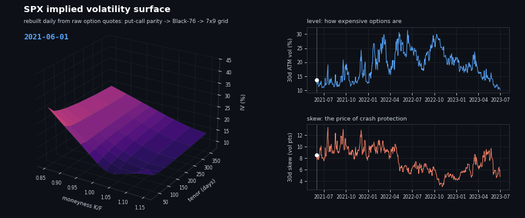

<h1 align="center">DS4FE &mdash; Data Science for Financial Engineering</h1>

<p align="center"><b>Implied-volatility surfaces and limit-order-book manifolds, rebuilt from raw market data.</b></p>

<p align="center">
  
</p>

<p align="center"><i>523 trading days of the SPX implied-vol surface (Jun 2021 &rarr; Jun 2023), each one reconstructed from raw end-of-day option quotes: put-call parity recovers the forward and rate, Black-76 inversion gives the IV, interpolation lands it on a fixed 7&times;9 grid. Watch the 2022 bear market arrive and unwind.</i></p>

## Headline results

- **The SPX smile is not sticky-delta.** The skew-stickiness ratio declines from **1.31 at 30d to 0.96 at 1y** &mdash; short-dated vol over-reacts to spot moves (leverage effect on top of the smile slide), 1-year vol is almost exactly sticky-strike.
- **Three linear factors explain 99.0% of surface variation** &mdash; level, term structure, skew &mdash; a clean replication of Cont &amp; da Fonseca (2002) on 2021&ndash;2023 data.
- **Nonlinear dimension reduction does not beat PCA here.** ISOMAP's leading coordinate correlates 1.00 with the level factor &mdash; it rediscovers the linear answer the long way. The same verdict holds for limit-order-book states once you control for embedding dimension and persistence.

## The implied-vol series

| Notebook | What it shows |
|---|---|
| [`DS4FE_SPX_IV_Surface_Reconstruction_from_Raw_EOD_Quotes.ipynb`](DS4FE_SPX_IV_Surface_Reconstruction_from_Raw_EOD_Quotes.ipynb) | The full pipeline, layer by layer: raw quotes &rarr; parity regression (F, r) &rarr; Black-76 inversion &rarr; smile &rarr; surface grid |
| [`DS4FE_IV_Surface_Skew_Dynamics.ipynb`](DS4FE_IV_Surface_Skew_Dynamics.ipynb) | Smile features (level / skew / curvature by tenor), the sticky-strike vs sticky-delta test (SSR), PCA vs ISOMAP on the surface panel |
| [`DS4FE_IV_Surface_DimReduction.ipynb`](DS4FE_IV_Surface_DimReduction.ipynb) | PCA vs ISOMAP head-to-head: variance reconstruction, embeddings, robustness to the interpolation scheme |
| [`DS4FE_IV_Surface_Representation_Test.ipynb`](DS4FE_IV_Surface_Representation_Test.ipynb) | Does flattening the surface to a vector hide nonlinear structure? Tensor/HOSVD, functional PCA, Sobolev metrics say no |

## The limit-order-book series

| Notebook | What it shows |
|---|---|
| [`DS4FE_Part4a_LOB_Data_Demo.ipynb`](DS4FE_Part4a_LOB_Data_Demo.ipynb) | MBP-10 order-book data tour |
| [`DS4FE_Part4f_ISOMAP.ipynb`](DS4FE_Part4f_ISOMAP.ipynb) | Manifold learning on order-book states |
| [`DS4FE_Part4g_DR_Comparison.ipynb`](DS4FE_Part4g_DR_Comparison.ipynb) | PCA vs ISOMAP vs UMAP vs diffusion maps across symbols, with dimension and persistence controls |
| [`DS4FE_Part4i_Stress_Projection.ipynb`](DS4FE_Part4i_Stress_Projection.ipynb) | Projecting a stress day (Aug 5, 2024) onto a calm-day manifold |

## Reproducing

```bash
pip install numpy pandas scipy scikit-learn matplotlib pyarrow
# data/ is not tracked; the download_*.py scripts fetch the raw inputs
python experiments/iv_surface/make_readme_gif.py   # regenerates the animation above
```

Notebooks are self-contained and run top to bottom against `data/`.
